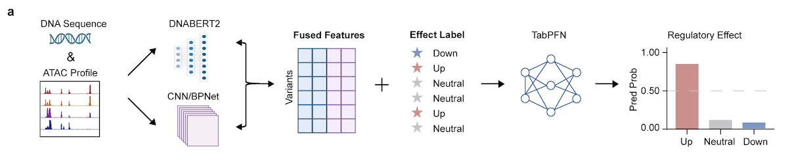

# REG-FOCUS (REGulatory effects based on Fusion Of Chromatin and Underlying Sequences)

## Introduction
REG-FOCUS is a transferable model framework designed to predict regulatory effects of genetic variants across celltypes.  


REG-FOCUS integrates two complementary representations, a DNA sequence foundation model (DNABERT2) that captures sequence grammar, and a chromatin-specialized model (ChromBPNet) that encodes cell-type-specific chromatin accessibility landscapes. These representations are fused into context-aware features. Crucially, rather than relying solely on inference from reference sequences, we introduce direct functional supervision by coupling these features with experimentally derived variant effect measurement and feeding them into a meta-learned tabular reasoning model, TabPFN. Leveraging its meta-learning capability, REG-FOCUS learns a transferable feature-to-effect mapping across cell types and assigns each variant to one of three regulatory outcome categories: up, down or neutral.


## Model 
Due to GitHub file size limitations, the full datasets and the model in this study are hosted on Zenodo. All resources can be accessed via the following DOI: [10.5281/zenodo.19068193](https://zenodo.org/uploads/19068193)
### REG-FOCUS Fine-tuned model
We provide task-specific fine-tuned models trained on our PBMC chromatin accessibility dataset:
```
./fine-tuned_model/dnabert2/sc-PBMC
./fine-tuned_model/chrombpnet/sc-PBMC
```
If you would like to fine-tune the framework on your own datasets, you can obtain the corresponding pre-trained models from the official repositories:
- DNABERT-2: https://github.com/MAGICS-LAB/DNABERT_2
- ChromBPNet: https://github.com/kundajelab/chrombpnet 

### REG-FOCUS Classifier model
The TabPFN model was trained on experimentally validated effect variants from CD14 monocytes and can be extended to other cell types.
The trained model is available in this repository at:
```
./classifier_model/tabpfn
```

## Quick Start
REG-FOCUS requires a Python 3.10 environment with all required dependencies installed. In the following examples, CD14 monocytes are used as a representative cell type.

**(1)Prepare the input variant file for prediction**<br>
Create a TSV file containing the variants to be evaluated by REG-FOCUS.
Example:
> SNP_for_pred.tsv
```
chr1	817186	G	A	chr1:817186:G:A
chr1	817341	A	G	chr1:817341:A:G
chr1	817514	T	C	chr1:817514:T:C
chr1	897376	T	G	chr1:897376:T:G
chr1	897538	T	C	chr1:897538:T:C
......
```

**(2)Generate allele-specific feature representations using the fine-tuned models**<br>
REG-FOCUS extracts allele-specific regulatory features using two fine-tuned models: DNABERT2 and ChromBPNet.
> Generate DNABERT2 features
```
python ./scripts/DNABERT2_testSNP_seq_prepare.py \
--ref ./data/hg38.fa \
SNP_for_pred.tsv

python ./scripts/DNABERT2_testSNP_feature_pred.py \
  --model_path ./fine-tuned_model/dnabert2/sc-PBMC/dnabert2_finetune_CD14mono/checkpoint-3800 \
  --input_dir ./SNP_for_pred \
  --output_file ./dnabert2_feature/SNP_for_pred_CD14mono.csv \
  --max_length 120 \
  --batch_size 256
```
> Generate ChromBPNet features
```
bash ./scripts/ChromBPNet_testSNP_feature_pred.sh --cell CD14mono --list SNP_for_pred.tsv
```
> fused two model feature representations
```
python ./scripts/DNABERT2_ChromBPNet_feature_merged.py \
    --chrombpnet_file chrombpnet.tsv \
    --dnabert_file dnabert.csv \
    --output_file merged_features.csv
```

**(3) Predict regulatory effects using the classifier**<br>
The classifier model assigns each variant to one of three regulatory outcome categories:
- **0 (Up)**: Increased chromatin accessibility  
- **1 (Down)**: Decreased chromatin accessibility  
- **2 (Neutral)**: No predicted regulatory effects

```
python ./scripts/TabPFN_testSNP_classifier_pred.py --input_file merged_features.csv
```

## Cite
```
@article{}
```

